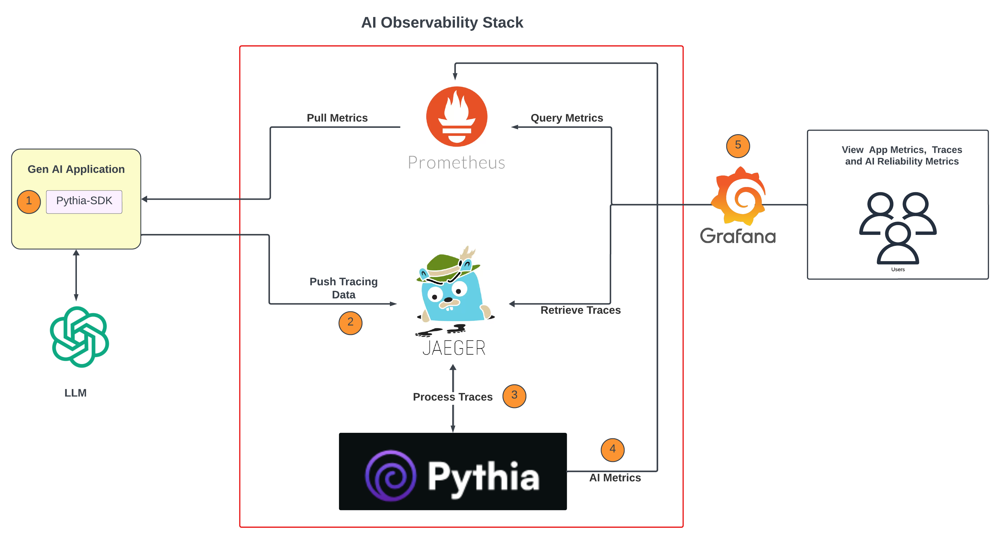

# Pythia




### Before you start 
#### LLM Model
##### Default Model Endpoint
The Pythia Stack provide a default model as docker and to use it make sure to have this set in the `.env` file.

```
#Pythia
OPENAI_API_KEY=default
MODEL_BASE_URL=http://pythia-model:8080/v1
```

##### Custom Model Endpoint
To use a model that is compatible with OpenAi Client set the `OPENAI_API_KEY` and `MODEL_BASE_URL` as needed in the `.env` file.

For example using OpenAi
```bash
OPENAI_API_KEY=sk-********
MODEL_BASE_URL=https://api.openai.com/v1
```

#### Model Name
If the model endpoint supports multiple models you can change the model name using the `MODEL_NAME` parameter in the `.env` file.

```
MODEL_NAME=gpt-4o
```

### Custum service Name
If you want to change where and from were pythia writes and reads traces you can set the `JAEGER_SERVICE_NAME` in the .env file and also set the `service_name` for the Pythia traces to your value. The default value is `default`.

```
JAEGER_SERVICE_NAME=default
```

```python
## Pythia Trace Collector with custom service name
traces = PythiaTraces(endpoint="http://localhost:4318", service_name="test2")
traces.init()
```

## Validators

### Configuration
Pythia Offers a variety of LLM validators in order to check the input and output for the model.
This validators can be enabled or disabled using the config file `configurations/validators/config.yaml`.

```yaml
    - name: detect_pii
      description: "The Anonymize Scanner acts as your digital guardian, ensuring your user prompts remain confidential and free from sensitive data exposure."
      source: llm Guard
      enabled: true
      input: input_reference
      output: input_response
```


The response for the validators Will pe set on the pythia Traces.


### Add new validator
The next steps explain how a new validator can be added using the current format. This change require a new image build/deployment.

#### 1. Add the actual implementation under `pythia/validators/`
Create a file with the validator implementation following the template

```python
### validator implementation template
def validate(text):
    try:
        #some config
        err_msg, is_valid, risk_score = validate_text(text)

        return {
            "isValid": is_valid,
            "errorMessage": err_msg,
            "riskScore": risk_score

        }
    except Exception as e:
        print(e)
        return {
            "isValid": False,
            "errorMessage": str(e),
            "riskScore": 1
        }
```

#### 2. Create a method with the validator name to be called 
This part will allow us to call specific validators using only the name and also allow us to prepare
the input and also how the validator is user (input, output or both base on the config)
Add the method in the ValidatorCall clss in `validator_call.py`

```python
from pythia.validators import validator_impl as validator_method

class ValidatorCall:
    def detect_pii(self, validator, **kwargs):
        question = get_question(kwargs=kwargs)
        input_data_reference = get_input_data(validator=validator, kwargs=kwargs)
        output_data_response = get_output_data(validator=validator, kwargs=kwargs)
        validator_results = []
        if input_data_reference:
            validator_result = validator_method.validate(text=input_data_reference)
            validator_result["validatedField"] = validator["input"]
            validator_result["validator"] = validator
            validator_results.append(validator_result)
        if output_data_response:
            validator_result = validator_method.validate(text=output_data_response)
            validator_result["validatedField"] = validator["output"]
            validator_result["validator"] = validator
            validator_results.append(validator_result)
        return validator_results
```

#### 3. Add the validator to the config file
We control what validators are executed using the `config.yaml` file therefore we have to add the new created
validator the file and enable him. Also we can specify what field to be use for the input or output ( null if no support)
```yaml
    - name: validator_name
      description: "Custom Validaotr"
      source: custom
      enabled: true
      input: input_reference
      output: input_response
```
## Run the docker compose 
```
docker compose up --force-recreate --remove-orphans --detach
```


### Add the Pythia Trace collector to your app 

#### Install pythia sdk

# pythia-sdk

## As a library
You can install the project as a library from github
```commandline
pip install git+https://github.com/wisecubeai/pythia-sdk
```
or if you don't have the git configure use the token
```
pip install git+https://<GIT_TOKEN>@github.com/wisecubeai/pythia-sdk
```

```python
import os
from fastapi import FastAPI
from openai import OpenAI

app = FastAPI()
from traces.pythia_wrapper import PythiaTraces

# take the correct port for the otl collector
traces = PythiaTraces(endpoint="http://localhost:63714")
traces.init()

client = OpenAI(api_key=os.getenv("OPENAI_API_KEY"))


@app.get("/")
def metric_method():
    chat_completion = client.chat.completions.create(
        messages=[
            {"role": "system",
             "content": "There is no significant chamber enlargement or hypertrophy.  There is no pericardial effusion or vegetations seen.  Doppler interrogation, including color flow imaging, reveals systemic venous return to the right atrium with normal tricuspid inflow. Pulmonary outflow is normal at the valve.  Pulmonary venous return is to the left atrium.  The interatrial septum is intact.  Mitral inflow and ascending aorta flow are normal.  The aortic valve is trileaflet.  The coronary arteries appear to be normal in their origins.  The aortic arch is left-sided and patent with normal descending aorta pulsatility."
             },
            {"role": "user", "content": "What was theTNM stage of the cancer?"}
        ],
        model="gpt-4o",
    )
    return chat_completion

```


